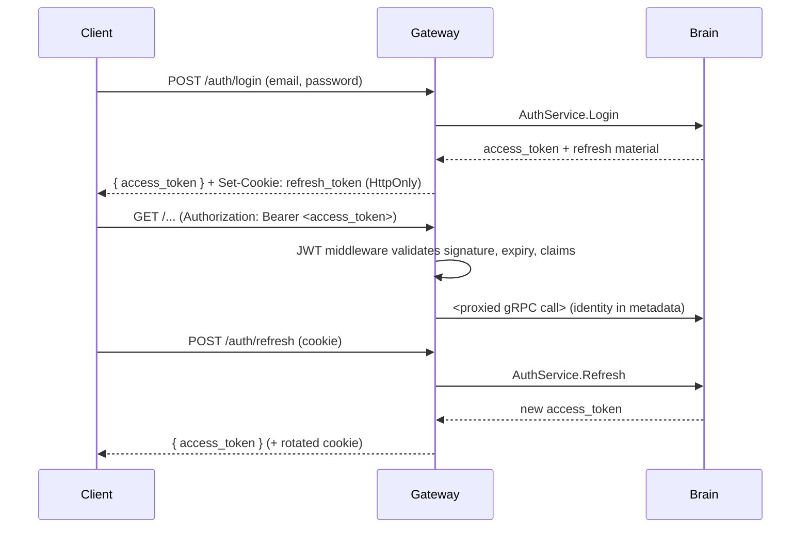

# 🔑 API Gateway Authentication

> **Note on the name:** the MVP v2 Gateway does **not** use Keycloak or an
> external OIDC provider. Authentication is handled by the Gateway itself
> (edge concerns) plus the Brain `AuthService` (credential verification). This
> file is kept under its historical name for link stability.

The Gateway is a thin edge: it terminates HTTP, validates tokens, and forwards
authenticated calls to the Brain over gRPC/mTLS. It holds no user database.

---

## 👤 User sessions (Dashboard / CLI)

Short-lived **JWT access tokens** for requests, a long-lived **HTTP-only refresh
cookie** for session renewal.

| Route                      | Purpose                                                    |
| -------------------------- | ------------------------------------------------------- |
| `POST /auth/login`         | Verify credentials, return access token, set refresh cookie |
| `POST /auth/refresh`       | Rotate the access token using the refresh cookie           |
| `POST /auth/logout`        | Revoke the server-side refresh token, clear the cookie     |
| `GET  /auth/me`            | Return the current identity (id, email, role, company)     |
| `POST /auth/setup-password`| Activate an invited account; returns the agent token once  |

### First-login activation

Invited owners/users are created `pending_activation`. `POST /auth/setup-password`
takes the one-time invitation token (`aegis_inv_...`) and the new password; the
Brain verifies it is unused and unexpired, hashes the password, activates the
account, and — for company owners — returns the clear `ag_` deployment token
**once**.

---

## 🤖 Agent authentication

Agent routes use dedicated middleware, not user JWTs.

| Phase        | Credential                       | Header                                  |
| ------------ | ------------------------------- | ------------------------------------- |
| Registration | Deployment token `ag_<43+ chars>`| `Authorization: Bearer ag_...`          |
| Operational  | Agent secret                    | `Authorization: Bearer <agent_secret>`  |

Only the hash of each is stored server-side. Rotating or revoking the deployment
token does not disconnect already-registered agents.

---

## 🔐 Token handling rules

- Access tokens are validated on every protected route by JWT middleware
  (signature, expiry, and role/company claims).
- Refresh tokens live only in an `HttpOnly`, `Secure` cookie — never exposed to
  JavaScript — and are rotated on each refresh.
- The Gateway performs **no authorization business logic** beyond coarse role
  gates; the Brain re-checks tenant scope on every call.
- All Gateway → Brain traffic is mutual-TLS; identity travels in gRPC metadata.

---

## Configuration

| Variable                 | Purpose                                        |
| ------------------------ | ------------------------------------------- |
| `JWT_SECRET` / key config | Access-token signing/verification material    |
| `BRAIN_GRPC_ADDR`        | Brain gRPC endpoint (port `50051`)             |
| `BRAIN_TLS_CA_CERT` / `_CLIENT_CERT` / `_CLIENT_KEY` | mTLS material for the Brain channel |
| `COOKIE_DOMAIN` / `SECURE` | Refresh-cookie scope and flags                |

---

*Aegis AI Edge & Identity Engineering — 2026*
