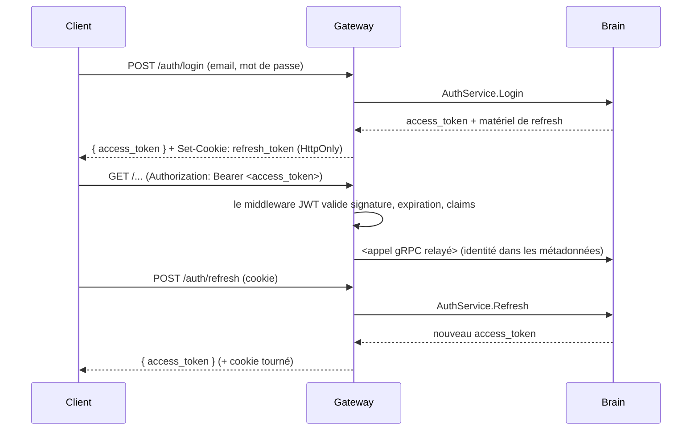

# 🔑 Authentification de l'API Gateway

> **Note sur le nom :** la Gateway MVP v2 n'utilise **pas** Keycloak ni de
> fournisseur OIDC externe. L'authentification est gérée par la Gateway elle-même
> (préoccupations de bordure) plus le `AuthService` du Brain (vérification des
> identifiants). Ce fichier conserve son nom historique pour la stabilité des
> liens.

La Gateway est une bordure fine : elle termine le HTTP, valide les tokens et
transmet les appels authentifiés au Brain en gRPC/mTLS. Elle ne détient aucune
base d'utilisateurs.

---

## 👤 Sessions utilisateur (Dashboard / CLI)

Des **access tokens JWT** courts pour les requêtes, un **cookie de refresh
HTTP-only** long pour le renouvellement de session.

| Route                      | Objectif                                                   |
| -------------------------- | ------------------------------------------------------- |
| `POST /auth/login`         | Vérifier les identifiants, renvoyer l'access token, poser le cookie de refresh |
| `POST /auth/refresh`       | Tourner l'access token via le cookie de refresh            |
| `POST /auth/logout`        | Révoquer le refresh token côté serveur, supprimer le cookie |
| `GET  /auth/me`            | Renvoyer l'identité courante (id, email, rôle, entreprise) |
| `POST /auth/setup-password`| Activer un compte invité ; renvoie le token agent une fois |

### Activation à la première connexion

Les owners/utilisateurs invités sont créés en `pending_activation`.
`POST /auth/setup-password` prend le token d'invitation à usage unique
(`aegis_inv_...`) et le nouveau mot de passe ; le Brain vérifie qu'il est
non utilisé et non expiré, hache le mot de passe, active le compte et — pour les
owners d'entreprise — renvoie le token de déploiement `ag_` en clair **une seule
fois**.

---

## 🤖 Authentification des agents

Les routes agent utilisent un middleware dédié, pas les JWT utilisateur.

| Phase          | Identifiant                       | En-tête                                |
| -------------- | ------------------------------- | ------------------------------------- |
| Enregistrement | Token de déploiement `ag_<43+ car.>` | `Authorization: Bearer ag_...`      |
| Opérationnel   | Secret agent                    | `Authorization: Bearer <agent_secret>`  |

Seul le hash de chacun est stocké côté serveur. Tourner ou révoquer le token de
déploiement ne déconnecte pas les agents déjà enregistrés.

---

## 🔐 Règles de gestion des tokens

- Les access tokens sont validés sur chaque route protégée par le middleware JWT
  (signature, expiration, claims de rôle/entreprise).
- Les refresh tokens ne vivent que dans un cookie `HttpOnly`, `Secure` — jamais
  exposé à JavaScript — et sont tournés à chaque refresh.
- La Gateway n'exécute **aucune logique métier d'autorisation** au-delà de portes
  de rôle grossières ; le Brain revérifie la portée tenant à chaque appel.
- Tout le trafic Gateway → Brain est en TLS mutuel ; l'identité voyage dans les
  métadonnées gRPC.

---

## Configuration

| Variable                 | Objectif                                       |
| ------------------------ | ------------------------------------------- |
| `JWT_SECRET` / config de clé | Matériel de signature/vérification des access tokens |
| `BRAIN_GRPC_ADDR`        | Endpoint gRPC du Brain (port `50051`)           |
| `BRAIN_TLS_CA_CERT` / `_CLIENT_CERT` / `_CLIENT_KEY` | Matériel mTLS du canal Brain |
| `COOKIE_DOMAIN` / `SECURE` | Portée et flags du cookie de refresh          |

---

*Ingénierie Bordure & Identité Aegis AI — 2026*
